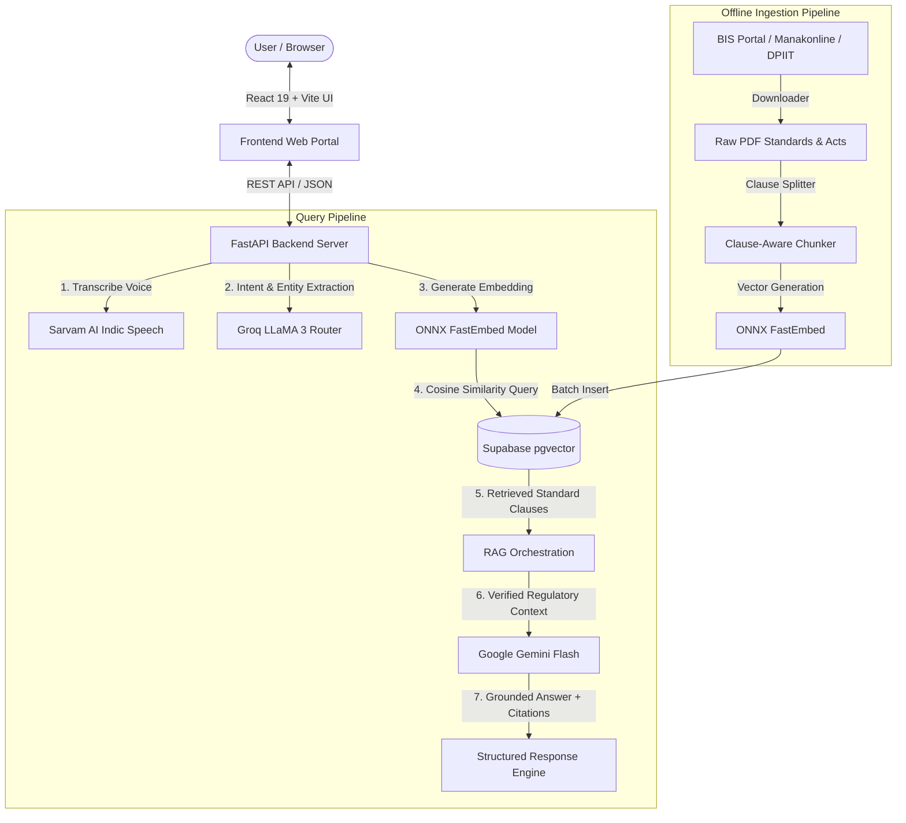

# 🇮🇳 BIS AI Assistant — Intelligent Bureau of Indian Standards Compliance & Consultation System

> **An enterprise-grade, multilingual AI compliance platform built for the Bureau of Indian Standards (BIS) regulatory framework. Empowers Indian consumers, domestic manufacturers, electronics importers, and foreign enterprises with instant, verified statutory intelligence, clause-level standard citations, factory testing calculators, and automated audit dossiers.**

---

[](https://fastapi.tiangolo.com)
[](https://react.dev/)
[](https://supabase.com)
[](https://groq.com)
[](https://ai.google.dev/)
[](https://sarvam.ai)
[](https://www.docker.com)
[](LICENSE)

---

## 📌 Table of Contents

- [Overview & Problem Statement](#-overview--problem-statement)
- [Key Features & Capabilities](#-key-features--capabilities)
- [The 4-Pillar Persona Segmentation](#-the-4-pillar-persona-segmentation)
- [System Architecture](#-system-architecture)
- [Knowledge Base & Clause-Aware RAG](#-knowledge-base--clause-aware-rag)
- [Repository Structure](#-repository-structure)
- [Quick Start (Local Development)](#-quick-start-local-development)
- [API Specification](#-api-specification)
- [Production Deployment](#-production-deployment)
- [Testing & Verification](#-testing--verification)
- [Security & Privacy](#-security--privacy)

---

## 🎯 Overview & Problem Statement

Navigating the Bureau of Indian Standards (BIS) ecosystem is notoriously challenging for businesses, foreign suppliers, and consumers:
* **Over 21,000+ Indian Standards (IS)** exist with frequent amendments.
* **Mandatory Quality Control Orders (QCOs)** issued by ministries (DPIIT, MeitY, MoEFCC) carry strict legal deadlines, MSME exemptions, and criminal penalties for non-compliance.
* **Multiple Complex Schemes**: Scheme-I (ISI Mark), Scheme-II (Compulsory Registration Scheme - CRS), Scheme-IV (Hallmarking), and FMCS (Foreign Manufacturers Certification Scheme).
* **Language Barriers**: Indian manufacturers and rural consumers require vernacular guidance in Hindi, Tamil, Telugu, Gujarati, and other regional languages.

**BIS AI Assistant** solves this by providing a conversational, RAG-grounded consultation engine that combines real-time semantic search over official gazettes, clause-level standard parsing, automated batch testing calculations, and exportable compliance consultation dossiers.

---

## 🌟 Key Features & Capabilities

* **Dual-Engine AI Architecture**:
  * **Groq LLaMA 3**: Ultra-low latency query intent classification, entity extraction (materials, product types, standard numbers), and query decomposition.
  * **Google Gemini 2.5/Flash**: Deep regulatory synthesis, strict anti-hallucination grounding, and structured compliance payload generation.
* **Hybrid Vector RAG (pgvector + FastEmbed)**:
  * Powered by `BAAI/bge-small-en-v1.5` (384-dimensional dense vectors) running locally on CPU via ONNX Runtime with zero API latency.
  * Stored and queried via cosine similarity in **Supabase PostgreSQL (`pgvector`)**.
* **Strict Anti-Hallucination Guardrails**:
  * The system **never invents standard numbers** (e.g., standard fallback guardrails prevent hallucinations like "IS 17803").
  * Distinguishes explicitly between compulsory QCO products and voluntary standards.
  * Surfaces verbatim clauses (e.g., *Clause 4.1*, *Table 2*, *Sampling Batch Size*).
* **Multilingual Indic Voice (Sarvam AI)**:
  * Speech-to-Text (STT) and Text-to-Speech (TTS) supporting **Hindi, Tamil, Telugu, Gujarati, Bengali, Kannada, Marathi, Malayalam, and Punjabi**.
  * Real-time audio waveform capture and native audio playback in the browser.
* **Interactive Conformity Calculator**:
  * Calculates factory sampling batch sizes, testing frequencies, and required in-house test equipment based on official Schemes of Inspection & Testing (SIT).
* **Automated Audit Checklist & Dossier Export**:
  * Generates actionable pre-audit gap checklists across 5 factory pillars (Raw Material, Lab Testing, Calibration, Hygiene/Safety, Marking).
  * 1-click export to branded, multi-page compliance consultation PDF reports.
* **Modern Adaptive Frontend**:
  * Built with **React 19**, **Vite**, **Tailwind CSS**, and **Framer Motion**.
  * Features a **4-Pill Segmented Persona Switcher**, **Live Gazette Marquee Ticker**, **Dedicated Chatbot Console**, and a **Floating Global Mini-Chatbot Launcher**.

---

## 🏛 The 4-Pillar Persona Segmentation

The assistant adapts its prompts, legal citations, and interface based on the active user persona:

```
┌─────────────────────────────────────────────────────────────────────────────────────────┐
│                                BIS ASSISTANT PERSONAS                                   │
├───────────────────┬───────────────────┬─────────────────────────┬───────────────────────┤
│ 🛒 Consumer       │ 🏭 Domestic Mfg   │ 🌐 Foreign Mfg (FMCS)   │ 💻 Electronics (CRS)  │
├───────────────────┼───────────────────┼─────────────────────────┼───────────────────────┤
│ • Gold Hallmarking│ • Scheme-I ISI    │ • Scheme-I FMCS         │ • Scheme-II CRS       │
│ • 6-digit HUID    │ • Factory Audits  │ • Authorized Indian Rep │ • Self-declaration    │
│ • Helmet Safety   │ • SIT Routine Lab │ • Custom Clearance      │ • LIMS Recognized Lab │
│ • Packaged Water  │ • Marking Fees    │ • Factory Inspection Fee│ • MeitY Notifications │
│ • BIS Care App    │ • MSME Concession │ • Performance Bank Guar.│ • Safety Under IS13252│
└───────────────────┴───────────────────┴─────────────────────────┴───────────────────────┘
```

---

## 🏗 System Architecture



---

## 📚 Knowledge Base & Clause-Aware RAG

### Document Registry Structure
The system categorizes statutory documentation inside [`knowledge_base/raw/`](knowledge_base/raw/):
1. **Statutory Acts & Regulations**: The Bureau of Indian Standards Act 2016, BIS Conformity Assessment Regulations 2018.
2. **Indian Standards (IS)**: IS 2347 (Domestic Pressure Cookers), IS 4151 (Motorcycle Helmets), IS 1417 (Gold Hallmarking), IS 2112 (Silver Hallmarking), IS 14543 (Packaged Drinking Water), IS 13252 (IT Equipment Safety), etc.
3. **Product Manuals & SITs**: Schemes of Inspection & Testing, factory laboratory checklists, test frequencies, and batch definitions.
4. **QCO Gazette Notifications**: Mandatory quality control orders by DPIIT and MeitY specifying enforcement dates and penalty provisions.

### Ingestion Commands

* **Automated Official Document Downloader**:
  ```powershell
  python backend/download_all_bis_docs.py
  ```
* **Dry-Run Preview of Documents**:
  ```powershell
  python backend/scripts/batch_ingest_all.py --dry-run
  ```
* **Run Full Batch Vector Ingestion into Supabase**:
  ```powershell
  python backend/scripts/batch_ingest_all.py
  ```
* **Ingest by Category**:
  ```powershell
  python backend/scripts/batch_ingest_all.py --category indian_standards
  ```

---

## 📁 Repository Structure

```
bis-assistant/
├── backend/
│   ├── app/
│   │   ├── api/
│   │   │   └── routes/
│   │   │       ├── audit.py             # Pre-audit checklist & gap analysis endpoints
│   │   │       ├── chat.py              # Conversational chat & RAG synthesis
│   │   │       ├── directory.py         # Recognized laboratory directory search
│   │   │       ├── documents.py         # Document catalogue & status management
│   │   │       ├── dossier.py           # Consultation dossier generation
│   │   │       ├── health.py            # System health check endpoint
│   │   │       └── voice.py             # Sarvam speech transcription & synthesis
│   │   ├── core/
│   │   │   ├── config.py                # Pydantic v2 settings & CORS configuration
│   │   │   ├── database.py              # Supabase pgvector client singleton
│   │   │   └── errors.py                # Unified exception handlers
│   │   ├── ingestion/
│   │   │   ├── chunker.py               # Clause-aware boundary splitter
│   │   │   ├── embeddings.py            # Vector embedding generator
│   │   │   ├── ingest.py                # Master PDF ingestion pipeline
│   │   │   ├── metadata.py              # Front-page standard metadata extractor
│   │   │   └── pdf_loader.py            # Text extraction with PyPDF
│   │   ├── schemas/                     # Pydantic request/response data contracts
│   │   ├── services/                    # Core business logic & AI orchestration
│   │   │   ├── chat_service.py          # Dual-engine synthesis coordinator
│   │   │   ├── gemini_service.py        # Gemini conversational grounding
│   │   │   ├── groq_service.py          # Groq intent classification router
│   │   │   ├── rag_service.py           # Supabase vector retrieval service
│   │   │   └── sarvam_service.py        # Indic STT / TTS service
│   │   └── main.py                      # FastAPI app entrypoint
│   ├── scripts/
│   │   ├── batch_ingest_all.py          # Bulk ingestion runner
│   │   └── catalogue_local_documents.py # Local directory scanner & SHA-256 validator
│   ├── Dockerfile                       # Production Python 3.11 container
│   ├── requirements.txt                 # Backend dependencies
│   └── download_all_bis_docs.py         # Automated statutory downloader
│
├── frontend/
│   ├── src/
│   │   ├── components/
│   │   │   ├── chat/                    # Main chat console, message cards, citations
│   │   │   ├── common/                  # Floating bot, mini popover window, modals
│   │   │   └── tabs/                    # CalculatorTab, AuditTab, DirectoryTab
│   │   ├── services/api.ts              # Centralized backend HTTP client
│   │   ├── App.jsx                      # Main layout & portal navigation
│   │   └── App.css                      # Custom styling & animations
│   ├── Dockerfile                       # Multi-stage Nginx container
│   ├── nginx.conf                       # Production Nginx reverse proxy configuration
│   ├── package.json                     # Frontend dependencies
│   └── vercel.json                      # Vercel SPA routing configuration
│
├── knowledge_base/                      # Statutory PDF repository & local caches
├── docker-compose.yml                   # 1-command full-stack container orchestration
├── render.yaml                          # Render infrastructure-as-code blueprint
├── DEPLOYMENT.md                        # Complete deployment manual
└── .gitignore                           # Security exclusions (.env, node_modules, venv)
```

---

## ⚡ Quick Start (Local Development)

### Prerequisites
* **Python 3.11+**
* **Node.js 18+** & **npm**
* **Supabase Project** with `pgvector` enabled ([Create Free Project](https://supabase.com))
* API Keys for **Groq**, **Google Gemini**, and **Sarvam AI**

---

### 1. Backend Setup

```powershell
# 1. Navigate to backend
cd g:\fastapi\bis-assistant\backend

# 2. Create and activate virtual environment
python -m venv venv
.\venv\Scripts\activate       # On Linux/macOS: source venv/bin/activate

# 3. Install dependencies
pip install -r requirements.txt

# 4. Configure environment variables
cp .env.example .env
# Edit .env with your Supabase, Groq, Gemini, and Sarvam credentials

# 5. Start the FastAPI development server
uvicorn app.main:app --host 127.0.0.1 --port 8000 --reload
```

* **Swagger API Documentation**: [http://127.0.0.1:8000/docs](http://127.0.0.1:8000/docs)
* **Alternative Redoc**: [http://127.0.0.1:8000/redoc](http://127.0.0.1:8000/redoc)
* **Health Check**: [http://127.0.0.1:8000/health](http://127.0.0.1:8000/health)

---

### 2. Frontend Setup

```powershell
# 1. Navigate to frontend
cd g:\fastapi\bis-assistant\frontend

# 2. Install dependencies
npm install

# 3. Start Vite development server
npm run dev
```

* **Web Application UI**: [http://localhost:5173](http://localhost:5173)

---

## 🔌 API Specification

### 1. Unified Compliance Chat
```http
POST /api/chat
Content-Type: application/json

{
  "message": "What are the mandatory marking requirements for gold jewellery under IS 1417:2016?",
  "language": "en",
  "persona": "consumer"
}
```

#### Sample Response Payload:
```json
{
  "success": true,
  "answer": "Under IS 1417:2016, gold jewellery sold in India must bear exactly three mandatory marks:\n1. BIS Standard Mark (Triangle logo)\n2. Purity / Fineness Grade (e.g., 22K916 for 22 karat, 18K750 for 18 karat)\n3. 6-digit alphanumeric HUID (Hallmark Unique Identification Number)\n\nConsumers can verify authenticity using the BIS Care App.",
  "query_analysis": {
    "intent": "hallmarking",
    "product": "gold jewellery",
    "standard_number": "IS 1417:2016",
    "confidence": 0.98
  },
  "citations": [
    {
      "standard_number": "IS 1417:2016",
      "clause_number": "Clause 5.1",
      "title": "Marking Requirements for Gold Artefacts",
      "source_type": "Indian Standard"
    }
  ],
  "certification_validation": {
    "is_mandatory": true,
    "scheme": "Scheme-IV (Hallmarking)",
    "enforcing_body": "Bureau of Indian Standards"
  }
}
```

### 2. Voice Transcription (STT)
```http
POST /api/voice/transcribe
Content-Type: multipart/form-data

file: <audio_file.wav>
language_code: "hi-IN"
```

### 3. Voice Synthesis (TTS)
```http
POST /api/voice/synthesize
Content-Type: application/json

{
  "text": "भारतीय मानक ब्यूरो में आपका स्वागत है।",
  "language_code": "hi-IN"
}
```

---

## 🚀 Production Deployment

### Option A: Free Cloud Hosting (Recommended)

* **Frontend**: **Vercel** *(Set Root Directory to `frontend`, add `VITE_API_URL` environment variable)*
* **Backend**: **Render.com** *(Set Root Directory to `backend`, Build Command: `pip install -r requirements.txt`, Start Command: `uvicorn app.main:app --host 0.0.0.0 --port $PORT`)*
* **Database**: **Supabase** *(pgvector cloud instance)*

*(Detailed step-by-step walkthrough is available in [`DEPLOYMENT.md`](DEPLOYMENT.md)).*

---

### Option B: 1-Command Docker Compose (VPS / AWS / GCP)

To spin up the entire application stack in isolated production containers:

```bash
docker compose up -d --build
```

* **Frontend**: Port `80`
* **Backend**: Port `8000`

---

## 🧪 Testing & Verification

Run automated test suites from the `backend/` directory:

```powershell
cd g:\fastapi\bis-assistant\backend

# Test intent classification routing
python test_intent_routing.py

# Test evidence retrieval and anti-hallucination guardrails
python test_evidence_validation.py

# Test RAG retrieval and vector queries
python test_rag.py

# Test laboratory directory service
python test_laboratory_service.py

# Test end-to-end multi-product queries
python test_all_products.py
```

---

## 🔒 Security & Privacy

* **Zero Exposure of Service Secrets**: All master administrative operations, database inserts, and LLM calls execute strictly on the backend. The Supabase `service_role` key is **never sent to the client**.
* **Clean Environment Boundary**: The root [`.gitignore`](.gitignore) rigorously excludes `.env`, `node_modules/`, `venv/`, and sensitive caches from git commits.
* **CORS Whitelisting**: Automated wildcard regex matching (`allow_origin_regex=r"https://.*\.vercel\.app"`) securely authorizes Vercel production and preview deployments while rejecting untrusted origins.

---

## 👥 Authors & Acknowledgements

Built for the **Smart India Hackathon (SIH)** — Dedicated to modernizing digital public infrastructure and simplifying quality standards compliance across India.

* **Bureau of Indian Standards (BIS)** for standard guidelines and public regulatory documentation.
* **Sarvam AI** for Indic regional language foundational models.
* **Groq & Google DeepMind** for ultra-fast LLaMA inference and Gemini foundational intelligence.

---

<div align="center">
  <sub>Bureau of Indian Standards AI Compliance Assistant • Empowering Quality, Safety & Regulatory Confidence</sub>
</div>
